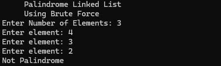
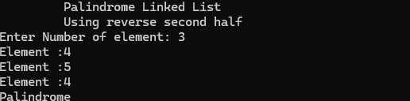

# Palindrome Linked List

This repository contains Python implementations to check whether a **Singly Linked List is a Palindrome** using two different approaches.

The project demonstrates the trade-offs between simplicity and space optimization.

---

## Files

| File | Description |
|------|-------------|
| `BruteForce.py` | Checks whether the linked list is a palindrome by storing elements in an array and comparing from both ends. |
| `reverseSecondHalf.py` | Checks whether the linked list is a palindrome by reversing the second half of the linked list and comparing both halves. |

---

## Approaches

## 1. Brute Force Approach

- Traverse the linked list and store all node values in a Python list.
- Use two pointers to compare elements from the beginning and end.
- If every element matches, the linked list is a palindrome.

### Time Complexity

| Operation | Complexity |
|-----------|------------|
| Traversal | O(n) |
| Comparison | O(n) |
| Total | O(n) |
| Extra Space | O(n) |

---

## 2. Reverse Second Half Approach

- Find the middle node using the slow and fast pointer technique.
- Reverse the second half of the linked list.
- Compare the first half and reversed second half node by node.
- If all nodes match, the linked list is a palindrome.

### Time Complexity

| Operation | Complexity |
|-----------|------------|
| Find Middle | O(n) |
| Reverse Second Half | O(n) |
| Compare Halves | O(n) |
| Total | O(n) |
| Extra Space | O(1) |

---

## Example

Input:

```text
1 → 2 → 3 → 2 → 1
```

Output:

```text
Palindrome
```

---

Input:

```text
1 → 2 → 3 → 4
```

Output:

```text
Not Palindrome
```

---

## Screenshots

### Brute Force Approach



### Reverse Second Half Approach



---

## Language

- Python 3

---

## How to Run

Run Brute Force Approach:

```bash
python BruteForce.py
```

Run Reverse Second Half Approach:

```bash
python reverseSecondHalf.py
```

---

## Purpose

This repository demonstrates two common approaches for solving the **Palindrome Linked List** problem.

It covers:

- Checking whether a linked list is a palindrome.
- Brute force solution using an array.
- Optimized solution using linked list reversal.
- Time and space complexity comparison.
- Understanding slow/fast pointers and in-place reversal techniques.