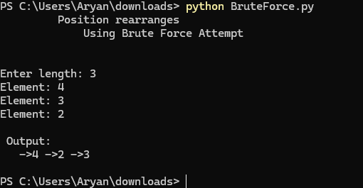
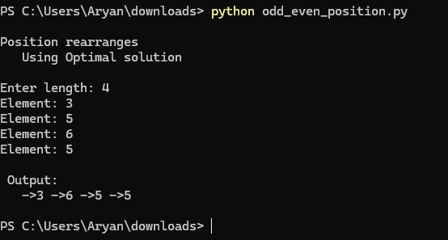

# Rearrange Linked List

This repository contains Python implementations to **rearrange a singly linked list** using two different approaches.

The project demonstrates both an extra-space solution and an optimized in-place solution for rearranging linked list nodes based on their positions.

---

## Files

| File | Description |
|------|-------------|
| `BruteForce.py` | Rearranges the linked list by storing nodes in an auxiliary data structure before rebuilding the list. |
| `odd_even_position.py` | Rearranges the linked list by grouping odd-positioned nodes followed by even-positioned nodes using pointer manipulation. |

---

## Approaches

## 1. Brute Force Approach

- Traverse the linked list and store nodes or values in an auxiliary data structure.
- Rearrange the elements according to the required order.
- Reconstruct the linked list with the rearranged nodes.

### Time Complexity

| Operation | Complexity |
|-----------|------------|
| Traversal | O(n) |
| Rearrangement | O(n) |
| Total | O(n) |
| Extra Space | O(n) |

---

## 2. Odd-Even Position Approach

- Separate nodes based on their **positions** (not values).
- Maintain two linked lists:
  - One for odd-positioned nodes.
  - One for even-positioned nodes.
- Connect the odd-positioned list to the beginning of the even-positioned list.
- Performs the rearrangement in-place without using extra memory.

### Time Complexity

| Operation | Complexity |
|-----------|------------|
| Traversal | O(n) |
| Rearrangement | O(n) |
| Total | O(n) |
| Extra Space | O(1) |

---

## Example

Input:

```text
1 → 2 → 3 → 4 → 5
```

Output:

```text
1 → 3 → 5 → 2 → 4
```

---

Input:

```text
2 → 1 → 3 → 5 → 6 → 4 → 7
```

Output:

```text
2 → 3 → 6 → 7 → 1 → 5 → 4
```

---

## Screenshots

### Brute Force Approach



### Odd-Even Position Approach



---

## Language

- Python 3

---

## How to Run

Run Brute Force Approach:

```bash
python BruteForce.py
```

Run Odd-Even Position Approach:

```bash
python odd_even_position.py
```

---

## Purpose

This repository demonstrates different approaches for **rearranging a singly linked list**.

It covers:

- Rearranging nodes based on their positions.
- Brute force solution using extra memory.
- Optimized in-place pointer manipulation.
- Time and space complexity comparison.
- Understanding linked list traversal and pointer operations.
```